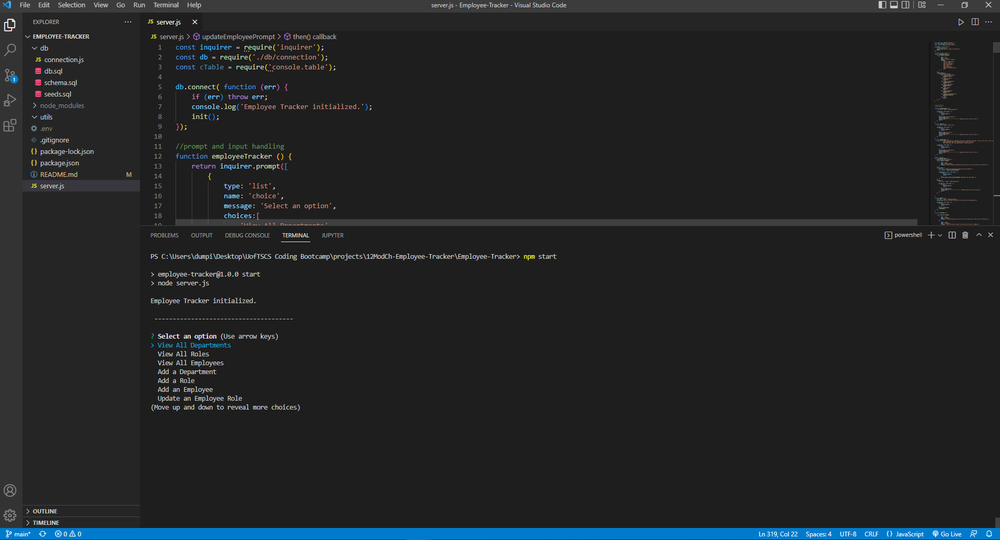

# Employee-Tracker
UofTSCS Coding Bootcamp: Module 12: MySQL (database)

## Purpose
This application allows the user to track and update employee information in a database (employees_db) by using prompts via inquirer@8.2.4 and sending queries to the database (MySQL).

## Built-With:
This application was built with:
* Javascript
* Node.js
* npm Inquirer
* npm dotenv
* npm mysql2
* npm content.table

## Repository
* [Repository Link](https://github.com/Bryandumpit/Employee-Tracker)

## Preview and Walkthrough

[Walkthrough Video](https://watch.screencastify.com/v/56XnRqHIBwu1vFZPL9Qo) "Employee Tracker Walkthrough"

## Contribution
Made with ❤️ by Bryan Dumpit!

